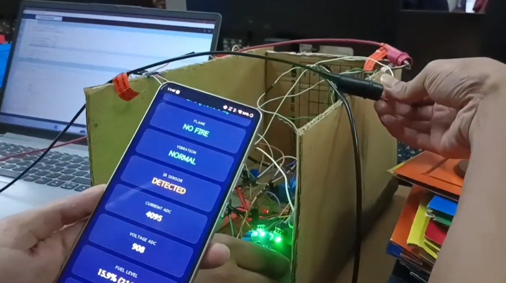

# PROJECT REPORT: ESP32 INDUSTRIAL MONITORING SYSTEM

An IoT-based real-time industrial telemetry and safety monitoring system powered by the ESP32 microcontroller. The system features multi-sensor telemetry, non-blocking asynchronous reading loops, automatic thermal relay control, and a responsive web dashboard accessible over local Wi-Fi or via direct Access Point (AP) mode.

---

## 🖼️ Project Prototype

<table>
<tr>
<td align="center">

### Prototype - Front View


</td>
<td align="center">

### Prototype - Top View


</td>
</tr>
<tr>
<td align="center">

<h3>Prototype - Demonstration Video</h3>

<a href="./video_20260711_122524.mp4">
  
</a>
</td>
</tr>
</table>

---

## 💻 Web Dashboard

<table>
<tr>
<td align="center">

### Live Monitoring Interface 1


</td>
<td align="center">

### Live Monitoring Interface 2


</td>
</tr>
</table>

---

## 1. PROJECT DESCRIPTION

The ESP32 Industrial Monitoring System is an IoT-based telemetry and safety solution designed for real-time facility and machine health monitoring. The system uses an ESP32 microcontroller to gather continuous data from an array of environmental, electrical, and physical sensors.  

It features an onboard HTTP web server that serves an interactive, dark-themed dashboard accessible via a local Wi-Fi network or directly through the ESP32’s Wi-Fi Access Point. Designed with non-blocking execution loops, the system handles dynamic thermal relay control, fuel level telemetry, and separate safety alert channels for operator perimeter security.

---

## 2. KEY FEATURES

* **Dual Wi-Fi Mode (`WIFI_AP_STA`):** Connects to a local router while simultaneously broadcasting a fallback hotspot (`ESP32-Dashboard`) for field access.  
* **Real-Time Interactive Dashboard:** Uses asynchronous JSON polling (`/data`) to update browser readings every second without page reloads.  
* **Independent Hazard Alerts:** Displays `STAY AWAY` or `ALL CLEAR` based on IR proximity detection without raising a false machine fault.  
* **Central Machine Fault Engine:** Aggregates gas leaks, high vibration, and fire alerts into a master `FAULT DETECTED` indicator.  
* **Automatic Cooling Relay:** Actuates a fan/cooling relay automatically when temperature reaches or exceeds 45.0°C.  
* **Non-Blocking Architecture:** Uses `millis()` timing routines to ensure smooth server handling and rapid sensor updating.

---

## 3. COMPONENT LIST & MODELS

| Component Class | Exact Model / Part Number | Quantity | System Interface / Pin |
| :--- | :--- | :---: | :--- |
| **Microcontroller** | ESP32-WROOM-32 (30-pin) | 1 | Master Controller |
| **Temperature Sensor** | DS18B20 (Waterproof probe) | 1 | Digital (`GPIO 4` / OneWire) |
| **Gas / Smoke Sensor** | MQ-2 Sensor Module | 1 | Analog (`GPIO 34`) |
| **Flame Sensor** | Optical IR Flame Sensor Module | 1 | Digital (`GPIO 14`) |
| **Vibration Sensor** | SW-420 Module | 1 | Digital (`GPIO 13`) |
| **Ultrasonic Sensor** | HC-SR04 Module | 1 | Trig: `GPIO 26`, Echo: `GPIO 33` |
| **Current Measurement** | Analog Current Signal Input | 1 | Analog (`GPIO 35`) |
| **Voltage Measurement** | Analog Voltage Signal Input | 1 | Analog (`GPIO 32`) |
| **Proximity Sensor** | IR Obstacle Avoidance Module | 1 | Digital (`GPIO 27`) |
| **Actuator Relay** | 5V 1-Channel Relay Module | 1 | Digital (`GPIO 23` - Active LOW) |

---

## 4. COMPONENT USAGE & JUSTIFICATION

### ESP32 Microcontroller
* **Where Used:** Main processing hub.  
* **Why:** Integrated Wi-Fi stack, fast dual-core architecture, and dual AP/STA mode capabilities.  

### DS18B20 Temperature Sensor
* **Where Used:** Mounted on machine casing or motor frame (`GPIO 4`).  
* **Why:** High precision over a single pin (OneWire bus); triggers cooling fan control at 45.0°C.  

### MQ-2 Gas Sensor
* **Where Used:** Near potential leak sources or exhaust areas (`GPIO 34`).  
* **Why:** Detects combustible gases and smoke via an analog value, raising an alarm if values exceed threshold ($2500$).  

### Optical Flame Sensor
* **Where Used:** Facing critical ignition points (`GPIO 14`).  
* **Why:** Detects infrared emission from open fire instantaneously (going LOW), skipping air heat lags.  

### SW-420 Vibration Sensor
* **Where Used:** Mounted directly on the chassis (`GPIO 13`).  
* **Why:** Flags loose components or mechanical imbalances when physical shocks trigger a HIGH signal.  

### HC-SR04 Ultrasonic Sensor
* **Where Used:** Fixed at top of liquid tank facing downward (Trig: `GPIO 26`, Echo: `GPIO 33`).  
* **Why:** Non-contact level sensing; pulse delays translate directly into fuel volume (mL) and percentage (%).  

### IR Proximity Sensor
* **Where Used:** Safety perimeter around moving parts (`GPIO 27`).  
* **Why:** Triggers an operator warning (`STAY AWAY`) on the web dashboard without stopping machine operations unnecessarily.  

### Analog Current & Voltage Signals
* **Where Used:** Power input rails (`GPIO 35` and `GPIO 32`).  
* **Why:** Directly samples system electrical health to monitor load anomalies.  

### 1-Channel Relay Module
* **Where Used:** Inline with external cooling fan supply (`GPIO 23`).  
* **Why:** Allows 3.3V GPIO logic to switch higher power loads safely (Active-LOW configuration).  

---

## 5. HARDWARE & SOFTWARE SPECIFICATIONS

### Hardware Specifications
* **Operating Voltage:** 5V DC (via Micro-USB / USB-C)  
* **Logic Voltage:** 3.3V DC (ESP32 GPIO)  
* **Wi-Fi Protocol:** 802.11 b/g/n (2.4 GHz)  
* **Thermal Monitoring Range:** -55°C to +125°C (DS18B20)  
* **Tank Level Range:** Max height 12.74 cm, Max volume 1350 mL  

### Software Specifications
* **Programming Environment:** Arduino IDE / PlatformIO  
* **Language/Framework:** C++ / Arduino Framework (`ESP32WebServer`, `OneWire`, `DallasTemperature`)  
* **Web Technology:** Single Page Application (SPA), HTML5, CSS3, JavaScript (Fetch API / JSON)  
* **Serial Baud Rate:** 115200 baud  

---

## 6. APPLICATIONS

* **Industrial Plant Automation:** Continuous monitoring of heavy machinery for overheating, abnormal vibration, or gas leaks.  
* **Chemical & Fuel Depots:** Non-contact liquid volume tracking paired with immediate fire and gas safety alerts.  
* **Restricted Equipment Safety Zone:** Perimeter safety warnings (`STAY AWAY`) to protect operators around hazardous machinery.  
* **Field & Remote Site Monitoring:** Direct Access Point mode allows technicians to perform on-site diagnostics using standard mobile web browsers without local network infrastructure.

---

## 🚀 Getting Started

### 1. Clone the Repository
```bash
git clone [https://github.com/your-username/esp32-industrial-monitoring-system.git](https://github.com/your-username/esp32-industrial-monitoring-system.git)
cd esp32-industrial-monitoring-system
   ```

2. **Configure Credentials:**
   Open the `.ino` file and update your Wi-Fi router credentials:
   ```cpp
   const char* ssid = "YOUR_WIFI_NAME";
   const char* password = "YOUR_WIFI_PASSWORD";
   ```

3. **Upload Code:**
   - Connect your ESP32 via Micro-USB / USB-C.
   - Select Board: `ESP32 Dev Module`.
   - Set Baud Rate to `115200`.
   - Compile and upload the sketch.

---

## 🌐 Accessing the Dashboard

### Option 1: Via Local Wi-Fi Router
1. Connect your phone or laptop to the same Wi-Fi router (`YOUR_WIFI_NAME`).
2. Open the **Arduino Serial Monitor** (115200 baud) after startup.
3. Locate the printed address: `Router Web Address: http://192.168.x.x`.
4. Enter the address into any modern browser.

### Option 2: Via Direct ESP32 Hotspot (Field Mode)
1. Scan for Wi-Fi networks on your mobile device or laptop.
2. Connect to network `ESP32-Dashboard` using password `12345678`.
3. Navigate to **`http://192.168.4.1`** in your browser.

---

## 📂 Project Structure

```text
├── esp32-industrial-monitoring-system.ino   # Main sketch & web server code
├── README.md                                # Project documentation
└── LICENSE                                  # Open-source license (MIT)
```

---

## 📄 License

This project is licensed under the MIT License - see the [LICENSE](LICENSE) file for details.
