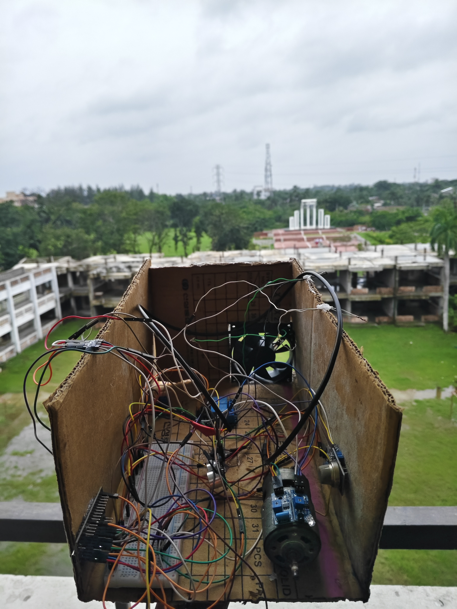
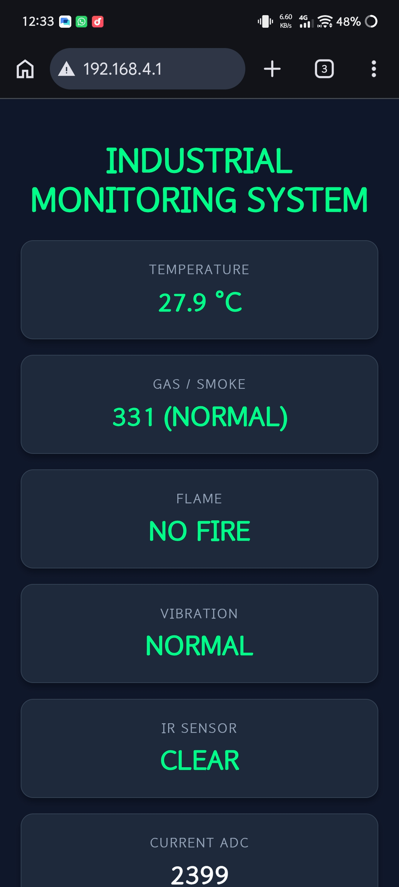
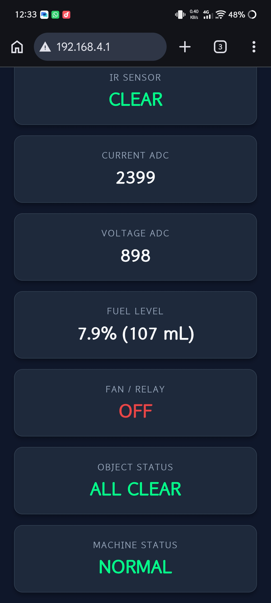

# Industrial Monitoring System (ESP32)

An IoT-based real-time industrial telemetry and safety monitoring system powered by the ESP32 microcontroller. The system features multi-sensor telemetry, non-blocking asynchronous reading loops, automatic thermal relay control, and a responsive web dashboard accessible over local Wi-Fi or via direct Access Point (AP) mode.

---

## 🖼️ Project Prototype

<table>
<tr>
<td align="center">

### Prototype - Front View


</td>
<td align="center">

### Prototype - Top View


</td>
</tr>
</table>

---

## 💻 Web Dashboard

<table>
<tr>
<td align="center">

### Live Monitoring Interface


</td>
<td align="center">

### Live Monitoring Interface


</td>
</tr>
</table>

---

## 📌 Features

- **Dual-Mode Wi-Fi Connectivity:** Functions simultaneously in Station (`STA`) mode (connecting to local router) and Direct Hotspot (`AP`) mode (fallback/field access at `192.168.4.1`).
- **Real-Time Web Dashboard:** Built-in web server serving an interactive, dark-themed UI updating via asynchronous JSON polling every 1 second.
- **Multi-Sensor Telemetry Array:**
  - **Temperature:** DS18B20 OneWire sensor (°C)
  - **Gas & Smoke:** MQ-2 Analog Gas Sensor
  - **Flame / Fire:** Digital Optical Flame Sensor
  - **Vibration:** Digital Vibration Sensor
  - **Proximity:** IR Obstacle Avoidance Sensor
  - **Fuel / Tank Level:** Ultrasonic (HC-SR04) level measurement converted to volume (mL) and percentage (%)
  - **Electrical Monitoring:** Analog Current and Voltage ADC inputs
- **Automated Relay Control:** Triggers cooling/fan relay dynamically when temperature exceeds defined threshold (45.0°C).
- **Dedicated Alert Logic:**
  - **Object Status:** Displays `STAY AWAY` (Alert) or `ALL CLEAR` (OK) based on IR proximity detection without affecting core machine telemetry.
  - **Machine Fault Detection:** Aggregates gas threshold breaches, fire alerts, and high vibration into a master `FAULT DETECTED` indicator.

---

## 🛠️ Hardware Requirements & Pin Mapping

| Component | Pin Type | ESP32 GPIO Pin | Description |
| :--- | :--- | :--- | :--- |
| **DS18B20** | Digital (OneWire) | `GPIO 4` | Temperature Sensor |
| **MQ-2 Gas Sensor** | Analog ADC | `GPIO 34` | Smoke & Combustible Gas Sensor |
| **Flame Sensor** | Digital | `GPIO 14` | Optical Flame Detection |
| **Vibration Sensor** | Digital | `GPIO 13` | Mechanical Shock / Vibration |
| **HC-SR04 Trigger** | Digital Output | `GPIO 26` | Ultrasonic Pulse Trigger |
| **HC-SR04 Echo** | Digital Input | `GPIO 33` | Ultrasonic Pulse Echo |
| **Current Sensor** | Analog ADC | `GPIO 35` | Current ADC Measurement |
| **Voltage Sensor** | Analog ADC | `GPIO 32` | Voltage ADC Measurement |
| **Relay / Fan** | Digital Output | `GPIO 23` | Active LOW Fan / Cooling Relay |
| **IR Proximity** | Digital | `GPIO 27` | Infrared Safety / Proximity Sensor |

---

## ⚙️ Software Prerequisites & Libraries

Ensure you have the following installed in your **Arduino IDE** or **PlatformIO**:

- **ESP32 Board Support Package** (v2.0+)
- **OneWire** library by Paul Stoffregen
- **DallasTemperature** library by Miles Burton

---

## 🚀 Getting Started

### 1. Clone the Repository
```bash
git clone [https://github.com/your-username/esp32-industrial-monitoring-system.git](https://github.com/your-username/esp32-industrial-monitoring-system.git)
cd esp32-industrial-monitoring-system
   ```

2. **Configure Credentials:**
   Open the `.ino` file and update your Wi-Fi router credentials:
   ```cpp
   const char* ssid = "YOUR_WIFI_NAME";
   const char* password = "YOUR_WIFI_PASSWORD";
   ```

3. **Upload Code:**
   - Connect your ESP32 via Micro-USB / USB-C.
   - Select Board: `ESP32 Dev Module`.
   - Set Baud Rate to `115200`.
   - Compile and upload the sketch.

---

## 🌐 Accessing the Dashboard

### Option 1: Via Local Wi-Fi Router
1. Connect your phone or laptop to the same Wi-Fi router (`YOUR_WIFI_NAME`).
2. Open the **Arduino Serial Monitor** (115200 baud) after startup.
3. Locate the printed address: `Router Web Address: http://192.168.x.x`.
4. Enter the address into any modern browser.

### Option 2: Via Direct ESP32 Hotspot (Field Mode)
1. Scan for Wi-Fi networks on your mobile device or laptop.
2. Connect to network `ESP32-Dashboard` using password `12345678`.
3. Navigate to **`http://192.168.4.1`** in your browser.

---

## 📂 Project Structure

```text
├── esp32-industrial-monitoring-system.ino   # Main sketch & web server code
├── README.md                                # Project documentation
└── LICENSE                                  # Open-source license (MIT)
```

---

## 📄 License

This project is licensed under the MIT License - see the [LICENSE](LICENSE) file for details.
